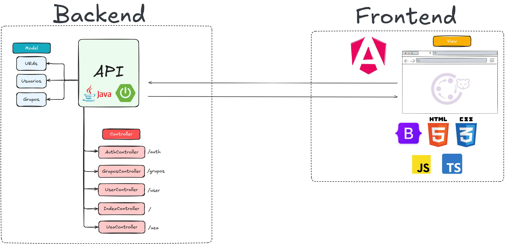
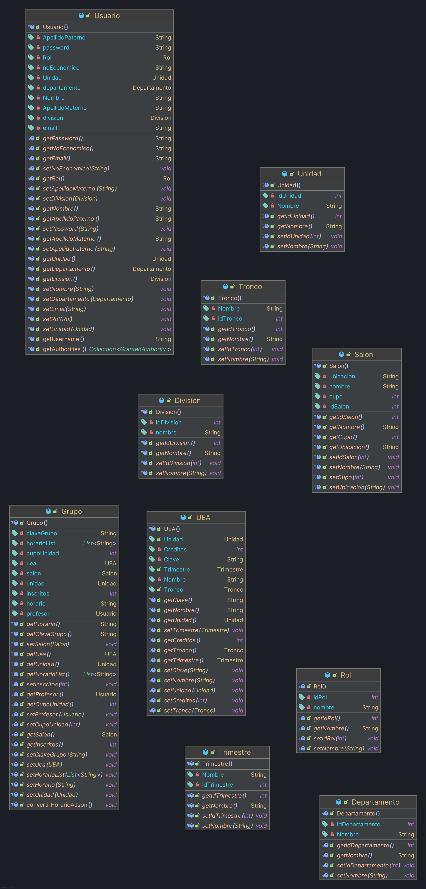
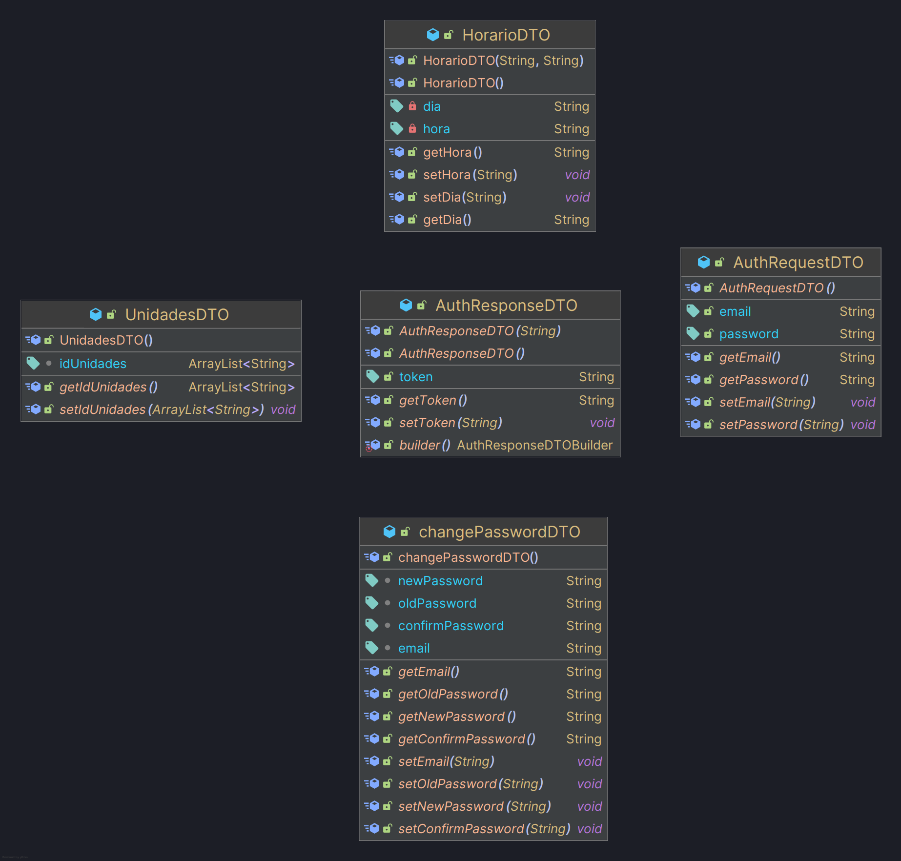

# API UAM Compartido
Este proyecto es una API desarrollada principalmente para gestionar los grupos compartidos de UAM. Una implementación del cliente que consume esta API se puede encontrar en el repositorio [Cliente UAM Compartido](https://github.com/diegocg100101/uam-compartido-angular). Esta API se puede consumir desde una aplicación web, desktop o móvil.

## Tecnologías
- Java (OpenJDK v17.0.13)
- Apache Tomcat (v10.1.34)
- Spring
- Spring Security
- Spring Boot (v3.4.2)
- JWT
- Hibernate
- Lombok
- MariaDB

## Instalación

### 1. Clonar el repositorio

Para clonar el repositorio se debe ejecutar el siguiente comando en una terminal Git posicionado en el directorio donde se desea clonar el repositorio:

```
git clone <url_del_repositorio>
```

Mediante Github Desktop solo basta con copiar el URL para clonar el repositorio.

### 2. Creación de la base de datos
Este proyecto requiere de una base de datos en MariaDB, por lo que dentro del directorio principal se ha facilitado un script SQL llamado **db_desarrollo_mariadb.sql** para ser ejecutado y generar todas las tablas y filas necesarias para funcionar correctamente.
> [!IMPORTANT]
> Se debe modificar el archivo **application.properties** en el directorio **src/main/resources** para configurar el usuario, contraseña y la base de datos en la máquina local.
> ```
> spring.datasource.url=jdbc:mariadb://localhost:3306/<base_de_datos>
> spring.datasource.username=<usuario>
> spring.datasource.password=<contraseña>
> ```

### 3. Modificación del CORS
En el archivo **SecurityConfig.java** ubicado en **Config** se debe modificar el **Bean** del CorsFilter para permitir peticiones de la dirección IP y puerto en la que se encuentra el cliente.

```java
@Bean
    public CorsFilter corsFilter() {
        UrlBasedCorsConfigurationSource source = new UrlBasedCorsConfigurationSource();
        CorsConfiguration config = new CorsConfiguration();
        config.setAllowedOrigins(List.of("http://<direccion_ip>:<puerto>")); // Modificación a realizar
        config.setAllowedMethods(List.of("GET", "POST", "PUT", "DELETE", "OPTIONS"));
        config.setAllowedHeaders(List.of("Authorization", "Content-Type"));
        config.setAllowCredentials(true);

        source.registerCorsConfiguration("/**", config);
        return new CorsFilter(source);
    }
```

### 4. Compilación del proyecto

Para Compilar el proyecto, se debe ejecutar el siguiente comando desde la terminal posicionada en el directorio del proyecto.

```
./mvnw clean package
```
Este comando permitirá analizar y compilar todas las dependencias Maven del proyecto.

### 5. Ejecutar servidor web

Para correr la aplicación, se requiere ejecutar el siguiente comando.

```
./mvnw spring-boot:run
```

Este comando ejecutará el servidor web, permitiendo que se procesen solicitudes HTTP. Las solicitudes deberán ser realizadas a **http://localhost:8080**

## API endpoints

| Endpoint                      | Descripción                                                                                                                                                                                                                                       | 
|-------------------------------|---------------------------------------------------------------------------------------------------------------------------------------------------------------------------------------------------------------------------------------------------|
| GET /                         | Devuelve un mensaje de bienvenida para confirmar el funcionamiento.                                                                                                                                                                               |
| GET /auth/signup              | Devuelve un JSON con todas las unidades en la base de datos, todas las divisiones y todos los departamentos.                                                                                                                                      |
| POST /auth/signup             | Almacena los datos del usuario recibido y devuelve una respuesta 200 en caso de ser exitoso, en caso contrario, devuelve una respuesta 404.                                                                                                       | 
| POST /auth/login              | Realiza el servicio de autenticación con el cuerpo recibido (email, contraseña) y devuelve una respuesta 200 en caso de ser exitoso, en caso contrario, devuelve una respuesta 404.                                                               |
| POST /auth/changepassword     | Valida que la contraseña antigua coincida y se reemplaza en la base de datos. En caso de que la contraseña antigua sea válida devuelve un mensaje "true", caso contrario devuelve "false". En caso de fallar, devuelve una respuesta 404.         |
| GET /user/me                  | Válida la autenticidad del usuario antes de devolver toda su información.                                                                                                                                                                         |
| GET /user/all                 | Devuelve un JSON listando toda la información de los usuarios.                                                                                                                                                                                    |
| GET /uea/add                  | Devuelve un JSON con todas las unidades en la base de datos, todos los troncos y los trimestres.                                                                                                                                                  |
| POST /uea/add                 | Recibe un cuerpo de UEA y lo almacena en la base de datos, en caso exitoso devuelve una respuesta 200, en caso contrario devuelve una respuesta 404.                                                                                              |
| GET /uea/list                 | Devuelve un JSON con todas las UEAs registradas en la base de datos.                                                                                                                                                                              |
| DELETE /uea/delete/{clave}    | Elimina la UEA correspondiente a la clave en el URL. En caso exitoso devuelve una respuesta 200, en caso contrario, devuelve una respuesta 404.                                                                                                   |
| GET /uea/edit/{clave}         | Devuelve un JSON con toda la información de la UEA correspondiente a la clave en el URL, todas las unidades, troncos y trimestres. En caso exitoso devuelve una respuesta 200, en caso contrario, devuelve una respuesta 404.                     |
| POST /uea/edit                | Recibe un cuerpo de UEA que será reemplazado en la base de datos. En caso de no existir una UEA con la misma clave, se devolverá una respuesta 404, en caso contrario, se devolverá una respuesta 200.                                            |
| GET /uea/share/{clave}        | Devuelve la información de la UEA correspondiente a la clave en el URL.                                                                                                                                                                           |
| POST /uea/share/{clave}       | Recibe una lista de IDs que corresponden las unidades donde se desea duplicar la UEA correspondiente a la clave en el URL. Devuelve una respuesta 200 si la UEA se pudo duplicar en las unidades, caso contrario devuelve una respuesta 404.      | 
| GET /grupos/add               | Devuelve un JSON con todas las UEAs, unidades, salones, dias, horas y usuarios en la base de datos.                                                                                                                                               |
| POST /grupos/add              | Recibe un cuerpo de Grupo y almacena los datos en la base de datos. En caso exitoso devuelve una respuesta 200, en caso contrario devuelve una respuesta 404.                                                                                     |
| GET /grupos/list              | Devuelve un JSON con un listado de todos los grupos registrados en la base de datos.                                                                                                                                                              |
| DELETE /grupos/delete/{clave} | Elimina en la base de datos el grupo correspondiente a la clave en el URL. En caso de ser exitoso, devuelve una respuesta 200, en caso contrario, devuelve una respuesta 404.                                                                     |
| GET /grupos/edit/{clave}      | Devuelve un JSON con la información del grupo correspondiente a la clave URL, todas las UEAs, unidades, salones, dias, horas y usuarios registrados en la base de datos. En caso de no existir un grupo con la clave, devuelve una respuesta 404. |
| POST /grupos/edit             | Recibe un cuerpo de Grupo que será reemplazado en la base de datos. En caso de no existir un Grupo con la misma clave, se devolverá una respuesta 404, en caso contrario, se devolverá una respuesta 200.                                         |
| POST /grupos/share/{clave}    | Recibe una lista de IDs que corresponden las unidades donde se desea duplicar el Grupo correspondiente a la clave en el URL. Devuelve una respuesta 200 si el Grupo se pudo duplicar en las unidades, caso contrario devuelve una respuesta 404.  |


## Implementación Web App
El siguiente diagrama muestra la implementación de una aplicación web con la API y un [cliente en Angular](https://github.com/diegocg100101/uam-compartido-angular). Por el momento, se deben clonar ambos repositorios y ejecutarse en una máquina local para observar su funcionamiento.



## Diagramas

### Base de datos
 
 
### Modelos


### DTO

