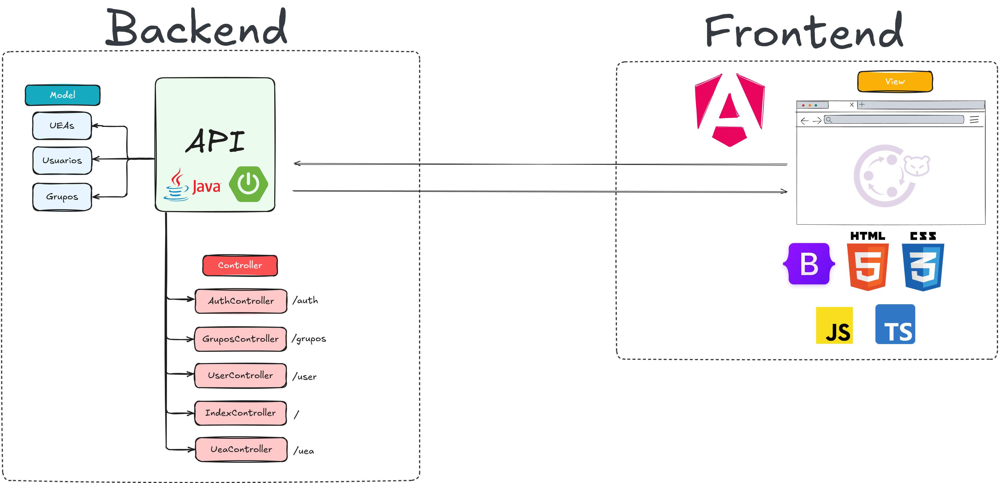
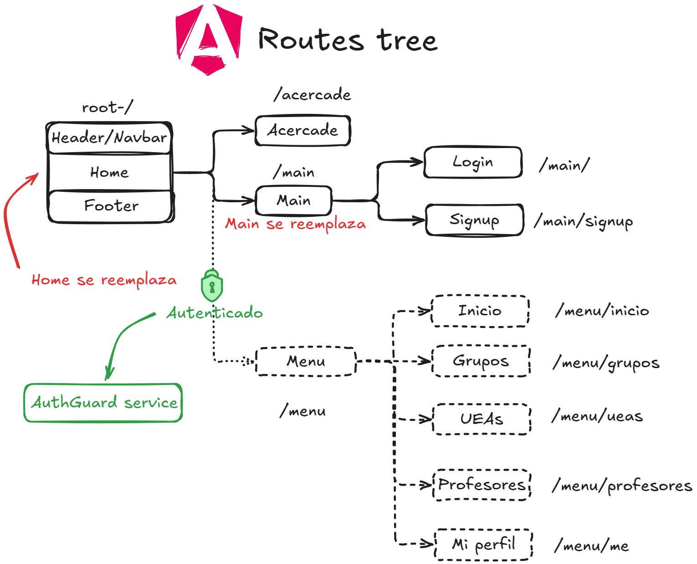

# Cliente de la API UAM Compartido
Este proyecto es un cliente en Angular que consume los endpoints de la [API UAM Compartido](https://github.com/diegocg100101/uam-compartido-spring.git). Funciona principalmente con el framework Angular.

## Tecnologías utilizadas

- Angular
- TypeScript
- Bootstrap
- HTML
- CSS

## Instalación y ejecución del proyecto

### 1. Clonar el repositorio

Para clonar el repositorio se debe ejecutar el siguiente comando en una terminal Git posicionado en el directorio donde se desea clonar el repositorio:

```
git clone <url_del_repositorio>
```

Mediante Github Desktop solo basta con copiar el URL para clonar el repositorio.

### 2. Instalación de Angular CLI

Para poder instalar Angular CLI es necesario tener instalado Node. Para instalar node siga los pasos en el [enlace](https://nodejs.org/en/download).

Una vez instalado node, se necesita correr el siguiente comando en la terminal.

```
npm install -g @angular/cli
```

Este comando instalará Angular CLI en la computadora en cuestión, permitiendo correr comandos de Angular para facilitar el desarrollo y la ejecución de la aplicación. [Vea la documentación](https://angular.dev/overview).

### 3. Iniciar servidor

Para correr el proyecto y, por ende, correr el servidor del cliente, se requiere ejecutar el siguiente comando en la terminal posicionada en el directorio del proyecto.

```
ng serve
```

Este comando de Angular CLI permite correr el servidor con las configuraciones previamente establecidas.

### 4. Abrir navegador

Para visualizar la aplicación, se requiere abrir un navegador y poner el siguiente URL.

```
localhost:4200
```

Esto hará que nuestro navegador realice una petición al servidor para que le devuelva la aplicación y sea posible la navegación.

> [!IMPORTANT]
> Como se mencionó en un inicio, esta aplicación consume la API UAM Compartido, por lo que es escencial que la API esté activa para poder realizar todas las operaciones mostradas en este cliente. Por el momento, este cliente solo puede consumir la API de manera local.

## Funcionalidad
Esta aplicación sigue el siguiente diagrama en el cual podemos observar la parte del backend y frontend, siento este repositorio el frontend o, bien, el cliente. Este cliente consume la API creada en el backend con Java y Spring, realiza peticiones por medio de métodos HTTP para enviar y recuperar información de la base de datos.



La siguiente imagen muestra un árbol de rutas que sigue la aplicación. Este árbol muestra qué secciones de la página serán reemplazadas dependiento de la ruta a la que acceda el usuario. Como se puede observar, habrá rutas protegidas que únicamente podrán ser accedidas una vez que el usuario esté autenticado por parte de la API.
